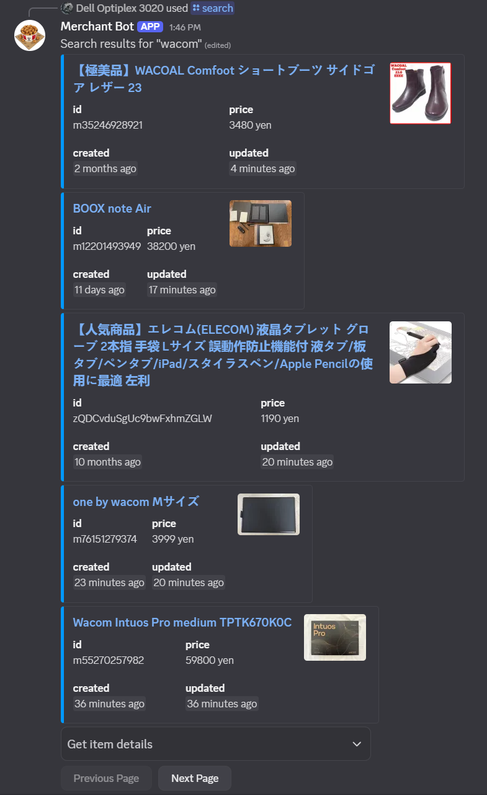

# Merchant Bot

## Merchant Bot is a Discord Bot for interacting with the Mercari Search API.

---

## Features

### At the moment the bot can:

-   🔍 **Search Mercari Listings**: Search for items on Mercari with filters like keyword, exclude keyword, price range, item condition, sorting, order.
-   📄 **Pagination**: Navigate through search results using buttons for previous and next pages (Mercari api uses endless scrolling but as pages)
-   🕒 **Custom Date Filters**: Search for items created within a specific time range. (WIP)

### Todo:

-   **Item Details**
-   **Per user query creation and tracking**
-   **New item notification**

---
